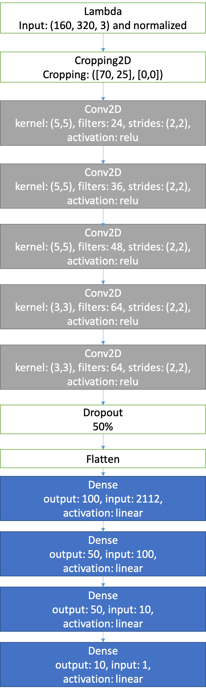
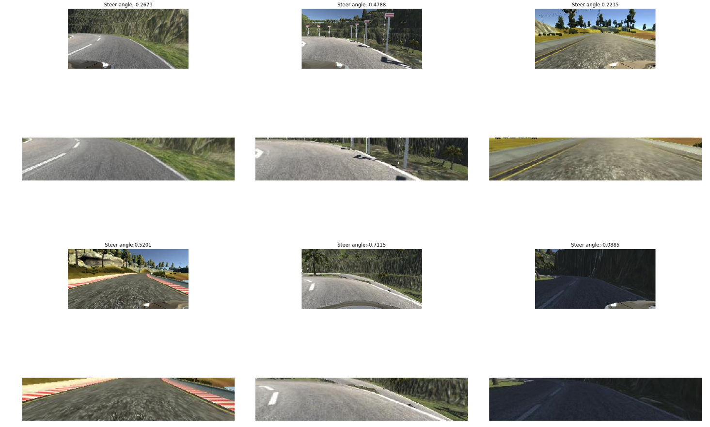
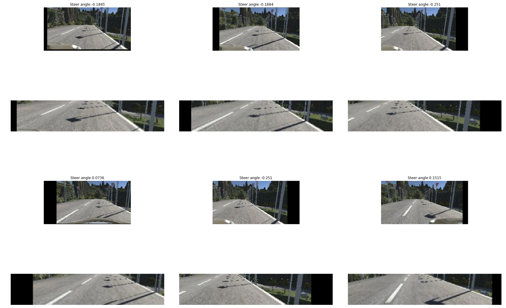
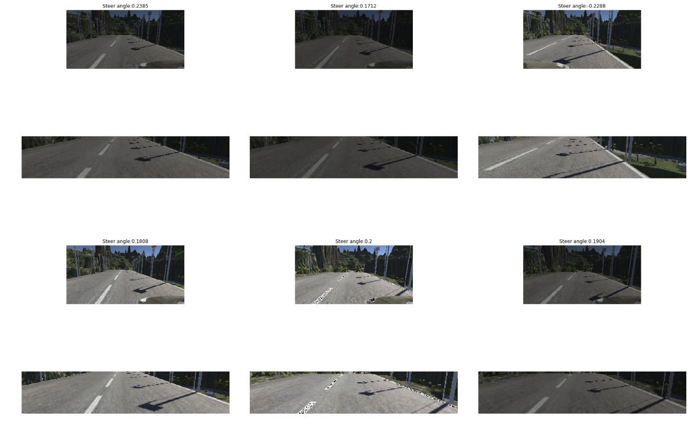
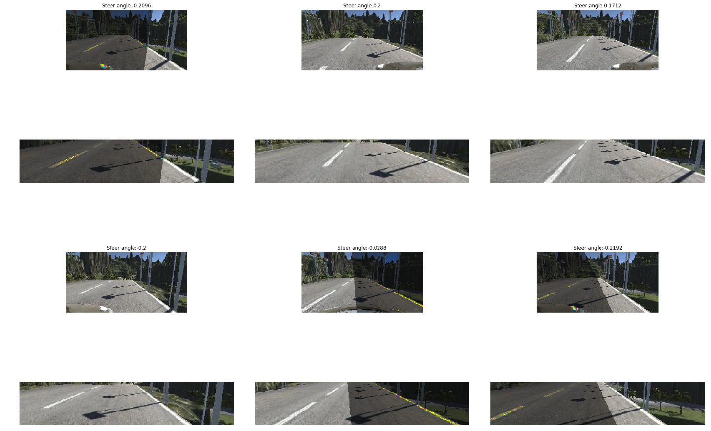
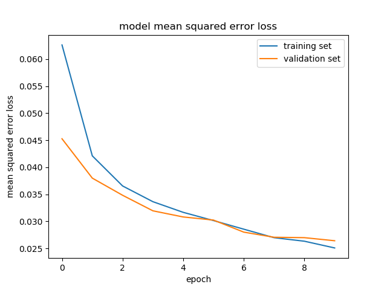

# Behavioral Cloning - Writeup

## Goals

The goals/steps of this project are the following:

- Collect driving videos using simulator.
- Analysis and augment the collected images
- Design and build a convolution neural network in that predicts steering angles from collected images.
- Train and validate the model with a training and validation set.
- Test that the model successfully drives around track one without leaving the road.
- Summarize the results with a written report.

## Rubric points

Here I will consider the [rubric points](https://review.udacity.com/#!/rubrics/1968/view) individually and describe how I addressed each point in my implementation.

### Files Submitted & Code Quality

#### 1. Submission includes all required files and can be used to run the simulator in autonomous mode
My project includes the following files:

- **model.py** : Containing the script to create and train the model
- **drive.py** : For driving the car in autonomous mode in the simulator (This is provided [Udacity](https://github.com/udacity/CarND-Behavioral-Cloning-P3/blob/master/drive.py), my only modification was to increase the car speed on line 47 from 9 to 15)
- **model.h5** : Containing a trained convolution neural network.
- **writeup.md** : Summarizing the results
- **video.mp4** : A recoding of the car drives around track one without leaving the road using the trained model

Node:

I tried [LeNet](http://yann.lecun.com/exdb/lenet/) model and it was not complex enough to generalize for track 2. I also modified [nVidia Autonomous Car Group](https://devblogs.nvidia.com/parallelforall/deep-learning-self-driving-cars/) model by adding dropouts to avoid overfitting. Both models can be found at [model.py](model.py).
The visualizations I used to create this report could be found at [visualize.ipynb](visualize.ipynb).

#### 2. Submission includes functional code Using the Udacity provided simulator and my drive.py file; the car can be driven autonomously around the track by executing

```
Python drive.py model.h5
```

#### 3. Submission code is usable and readable

The model.py file contains the code for training and saving the convolution neural network. The file shows the pipeline I used for training and validating the model, and it contains comments to explain how the code works. A thread-safe generator was used to avoid loading all training images into memory at once.

### Model Architecture and Training Strategy

#### 1. An appropriate model architecture has been employed

My initial approach was to use [LeNet](http://yann.lecun.com/exdb/lenet/), but it was hard to have the car inside the street for the second track (this model could be found [here](model.py#L122-L134)). After this, I decided to try the [nVidia Autonomous Car Group](https://devblogs.nvidia.com/parallelforall/deep-learning-self-driving-cars/) model, and the car drove through both the first track and the second track after 10 training epochs (this model could be found [here](model.py#L136-L152)).

A model summary is as follows:

```
Layer (type)                     Output Shape          Param #
=================================================================
lambda_1 (Lambda)                (None, 160, 320, 3)   0
_________________________________________________________________
cropping2d_1 (Cropping2D)        (None, 65, 320, 3)    0
_________________________________________________________________
conv2d_1 (Conv2D)                (None, 31, 158, 24)   1824
_________________________________________________________________
conv2d_2 (Conv2D)                (None, 14, 77, 36)    21636
_________________________________________________________________
conv2d_3 (Conv2D)                (None, 5, 37, 48)     43248
_________________________________________________________________
conv2d_4 (Conv2D)                (None, 3, 35, 64)     27712
_________________________________________________________________
conv2d_5 (Conv2D)                (None, 1, 33, 64)     36928
_________________________________________________________________
dropout_1 (Dropout)              (None, 1, 33, 64)     0
_________________________________________________________________
flatten_1 (Flatten)              (None, 2112)          0
_________________________________________________________________
dense_1 (Dense)                  (None, 100)           211300
_________________________________________________________________
dense_2 (Dense)                  (None, 50)            5050
_________________________________________________________________
dense_3 (Dense)                  (None, 10)            510
_________________________________________________________________
dense_4 (Dense)                  (None, 1)             11
=================================================================
Total params: 348,219
Trainable params: 348,219
Non-trainable params: 0
```

(More details about this bellow.)

#### 2. Attempts to reduce overfitting in the model

I decided to modify the model by applying regularization techniques like [Dropout](https://en.wikipedia.org/wiki/Dropout_(neural_networks)) because after 5 epoches' training, the loss of the training set was lower than the validation set by a slightly big margin. After adding the dropout layer right before fully connected layers helps the validation loss to drop.
In addition to that, I split my sample data into training and validation data. Using 80% as training and 20% as validation. This can be seen at [this part of the code](model.py#L210-L212).

#### 3. Model parameter tuning

The model used an Adam optimizer, so the learning rate was not tuned manually ([model.py line 220](model.py#L220)).

#### 4. Appropriate training data

The default training data was provided to keep the vehicle driving on the centre of the road by Udacity. I also collected two laps of manual driving data for the second track for each direction.

##### Use multiple cameras

The simulator provides three different images: center, left and right cameras. Each image was used to train the model.

##### Flip horizontally

By flipping all the contre, left, and right images horizontally and negate the steering angle, I have doubled my data set.

For details about how I created the training data using more data augmentation techniques, see the next section.

### Model Architecture and Training Strategy

#### 1. Solution Design Approach

Firstly, I tried the LeNet](http://yann.lecun.com/exdb/lenet/) model with 5 epochs with the training data provided by Udacity. A standard Lambda normalization layer was added at the beginning of the LeNet model, but the car can only make it to the first bridge. I increased the dataset by using left, and right images as well as flipping all of them. This allows the car to move a bit further, but it didn't get to the end. At that point, there was good amount of data, so I decided to try another more complex model.

The model I chose next was: [nVidia Autonomous Car Group](https://devblogs.nvidia.com/parallelforall/deep-learning-self-driving-cars/). And it was also the final model I used to complete both tracks. I have made two modifications to the model:

- Add a new layer at the end to have a single output as it was required.
- Add a dropout layer right before all the fully connected layers.

The car completed the first track, but there it passed over the "dashed" line once. So I decided to augment the data a bit more.

#### 2. Final Model Architecture

The final model architecture is shown in the following image:



#### 3. Creation of the Training Set & Training Process

Initially, I just used the following techniques for data augmentation:

- Image cropping
- Random translation
- Random exposure
- Random shadow

##### Image cropping

This can be seen at [this part of the code](model.py#L139).



##### Random translation

This can be seen at [this part of the code](model.py#L53-L60).



##### Random exposure

This can be seen at [this part of the code](model.py#L63-L68).



##### Random shadow

This can be seen at [this part of the code](model.py#L70-L89).



##### More training data

Even after all the above data augmentations, the car still drove into a shadow for the second track. So I decided to collect more data by driving the car manually in the backward direction, so I have the following data collection strategy：

- One loop driving forward for the first track(using default training dataset)
- Two laps of driving for the second track
    - One loop driving forward
    - One loop driving backward

All these data was used for training the model with 10 epochs. The data was shuffled randomly. The following picture shows the training:



As can be seen from the above chart, starting from 7th epoch, the model is kind off overfitting. So the best stopping point is 7th epoch.

After this training, the car was driving down the road all the time on the [first](video.mp4) and [second](video2.mp4) track. You can view a higher resolution of the two recordings from the two links below:

<a href="http://www.youtube.com/watch?feature=player_embedded&v=-WaWYfsJiFU
" target="_blank"></a>

<a href="http://www.youtube.com/watch?feature=player_embedded&v=URmpa5A-sog
" target="_blank"></a>

The full dataset can be downloaded [here](https://drive.google.com/open?id=1ushKB4MwrA0dPLQ9ix-UXmGLnZQU1-Yr). You can download and extract it to the root folder of this project.
